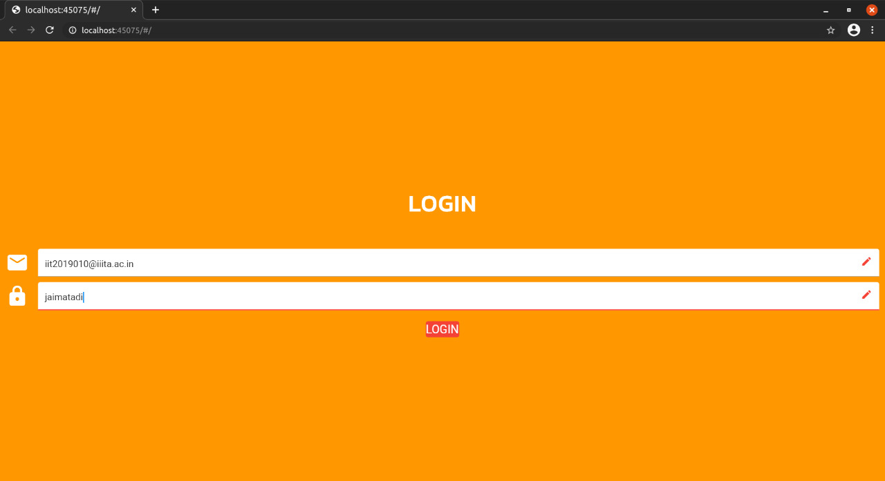
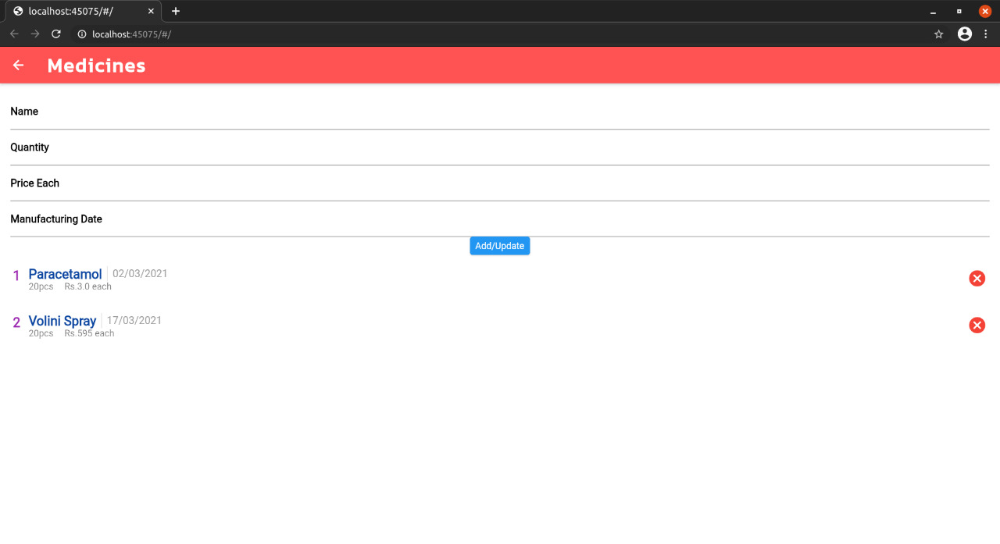
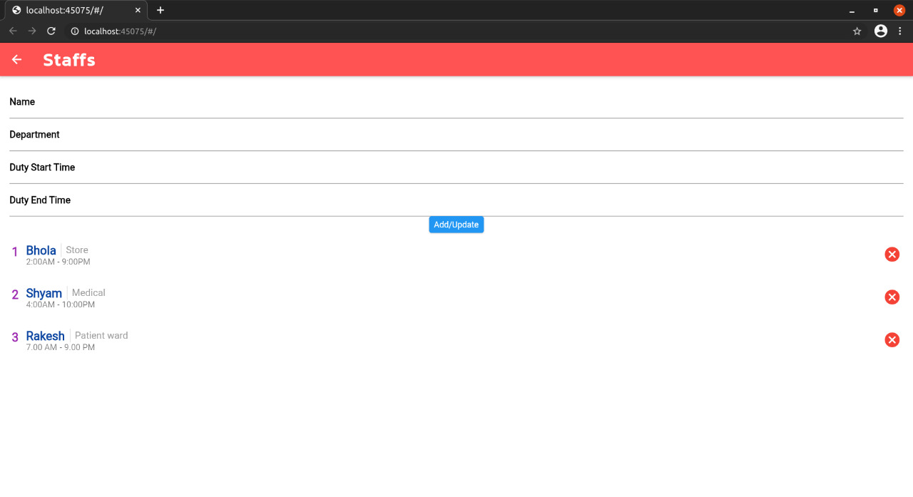

# healthieee

A new Flutter project.

## Getting Started
This project is a starting point for a Flutter application.
A few resources to get you started if this is your first Flutter project:

- [Lab: Write your first Flutter app](https://flutter.dev/docs/get-started/codelab)
- [Cookbook: Useful Flutter samples](https://flutter.dev/docs/cookbook)

It is an online virtual medical management project.

## GETTING INTO THE PROJECT:
The present world is moving towards the development of online services. In this context, the health care domain can be contributed by developing a web-based online platform that can be used for direct communication or appointments between doctors and patients. With this application, patients can book online appointments with their preferred doctors, and doctors can offer healthcare suggestions, e-prescription, and view the patient’s medical records, lab reports, etc. The application also lets users look for and connect with donors like blood, eye, kidney, etc.

This system has a ‘Home’ page from where the patient, doctor & administrator can enter into their module by selecting the user type. 

Fig 1.1 shows the ‘Home’ page of our project.

The ‘Home’ page consists of 3 modules:

1. Doctor Module
2. Patient Module
3. Admin Module

### DOCTOR MODULE
The doctors can login into their account or signup if not already registered. Fig 1.10 shows the page for login and signup option for a doctor. Registration of a doctor account is monitored by admin. We will discuss more about this in Admin Module.

After clicking on Signup button on the page(see figure 1.10), a signup portal opens with options to enter email and password.
Fig 1.20 shows the signup portal for doctor.

Once you click on Signup button, it leads to create Account page (see Fig 1.30).

After filling all the details like name,license no., qualifications etc., one must click on create profile option to create account on the software.

After clicking on Login button on the page(see figure 1.10), a login portal opens with options to enter email and password. Once you have registered, then only one can login.
Fig 1.40 shows the login portal for doctor.

Once the doctor clicking the ‘Login’ button, they will be redirected to their own dashboard which is shown in Fig 1.50

In this page, doctor can see their upcoming appointments which has been booked by the patients. 
Fig 1.60 shows the list of appointments of the doctor.

Then there is update profile page(Fig 1.80).

Once everything is done, the doctor can signout of their account. Thus, in general, a doctor can login into his/her account, view their appointments and update profile. This is all about Doctor Module.

### PATIENT MODULE
This module allows patients to create their account, book an appointment to see a doctor and see their appointment history. 

The patient can login into their account or signup if not already registered. Fig 2.10 shows the page for login and signup option for a patient. Registration of a patient account is monitored by admin. We will discuss more about this in Admin Module.

After clicking on Signup button on the page(see figure 2.10), a signup portal opens with options to enter email and password.
Fig 1.20 shows the signup portal for patient.

Once you click on Signup button, it leads to create Account page (see Fig 2.20).

After filling all the details like name, age, gender etc., one must click on create profile option to create account on the software.

After clicking on Login button on the page(see figure 2.10), a login portal opens with options to enter email and password. Once you have registered, then only one can login.
Fig 1.40 shows the login portal for patient which look same as doctor's login portal.

Once the patient clicking the ‘Login’ button, they will be redirected to their own dashboard which is shown in Fig 2.40.

The Dashboard page allows patients to perform three operations:
1) Patient can see their next appointment which has been booked earlier. 
2) Book his/her appointment -  Here, the patients can click on show available doctors option to select the doctor to make appointment (see fig 2.50).
4) Update profile page - The update profile page asks patients to enter their name, age, gender and upload a photo (see fig 2.60).

Once everything is done, the patient can signout of their account. This is all about Patient Module.

### ADMIN MODULE
This module is the heart of our project where an admin can see the list of all patients, doctors and other elements of the medical system like medicines supply etc.

The patient can login into their account or signup if not already registered. Fig 3.10 shows the page for login and signup option for a admin.

After clicking on Signup button on the page(see figure 3.10), a signup portal opens with options to enter email and password.
Fig 3.20 shows the signup portal for admin.

Once you click on Signup button, it leads to create Account page (see Fig 3.30).

After filling all the details like name, age, gender etc., one must click on create profile option to create account on the software.

After clicking on Login button on the page(see figure 3.10), a login portal opens with options to enter email and password. Once you have registered, then only one can login.
Fig 1.40 shows the login portal for admin looks same as doctors.

Once the admin click on the ‘Login’ button, they will be redirected to their own dashboard which is shown in Fig 3.50.

The Dashboard page allows admin to perform three operations:
1) Admin can see the list of medicines available currently and update/add medicines once they are shipped in or sold (see fig 3.60).

2) Add staffs / Update details of the staff members (see fig 3.70).

3) See the list of patients and can remove their account from the software (see fig 3.80).
4) See the list of doctors and can monitor them (see fig 3.90).

Once everything is done, the admin can signout of their account. This is all about Admin Module.
